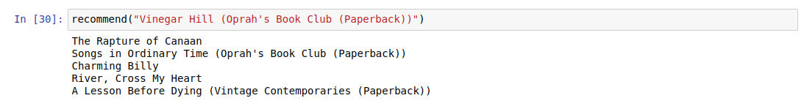
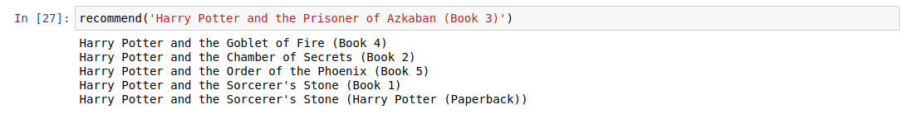
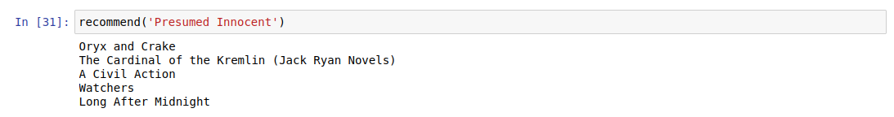
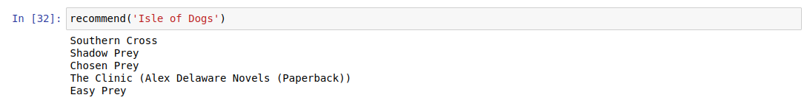

# Book Recommendation System using Collaborative Filtering 

## Introduction:
This repository contains the code for a Book Recommendation System implemented using collaborative filtering techniques. The system utilizes Python along with Pandas and NumPy libraries to process and analyze the data. The main goal of this project is to provide personalized book recommendations to users based on their preferences and behavior.

## Data Description:
The recommendation system uses three CSV files obtained from Kaggle - 'Books.csv,' 'Users.csv,' and 'Ratings.csv.' These datasets provide information about books, users, and book ratings, respectively. The 'Books.csv' file includes book details such as title, author, and ISBN. The 'Users.csv' file contains user information like ID and location. The 'Ratings.csv' file holds user ratings for various books.

## Implementation Highlights:

### Data Preprocessing and Filtering:

The 'ratings' DataFrame is merged with the 'books' DataFrame based on 'ISBN' to obtain average ratings for each book. Less popular books (with fewer than 250 ratings) are filtered out to ensure data relevance.
Users with fewer than 200 rated books are also filtered using the 'users' DataFrame to focus on users with significant preferences.

### Item-Based Collaborative Filtering:

A pivot table ('pt') is constructed with book titles as rows, user IDs as columns, and book ratings as cell values. This table serves as the foundation for the collaborative filtering process.
The cosine similarity is calculated between books to identify the most similar ones based on user preferences. The 'cosine_similarity' function from scikit-learn is utilized for this purpose.

### Personalized Recommendations:

The 'recommend' function provides personalized book recommendations to users based on their input book. The function utilizes precomputed similarity scores to find the top five books similar to the input, tailoring the suggestions to each user's preferences.

## Usage:

Clone the repository
Install the required libraries: pip install pandas numpy scikit-learn
Place the 'Books.csv,' 'Users.csv,' and 'Ratings.csv' files in the project directory.
Run the 'recommend' function, providing the name of the book as input: recommend('Your Book Title')

## Key Skills Demonstrated:

Collaborative Filtering
Data Preprocessing
Item-Based Recommendation
Python
Pandas
NumPy
Data Analysis

## Results:

## Conclusion:
The Book Recommendation System presented here effectively uses collaborative filtering to provide personalized book suggestions based on user preferences. The implementation is robust, and the project showcases valuable data preprocessing techniques and collaborative filtering algorithms. Feel free to use, modify, or contribute to this project to enhance its capabilities and accuracy.

Please let me know if you have any questions or need further information about the project!
